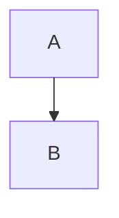

# Focus: diagram

A **diagram** directive asks architxt to explain a relationship, flow, or structure as a visual diagram. architxt renders diagrams as [Mermaid](https://mermaid.js.org/) flowcharts, so you can inspect, edit, copy, and export them like any other Mermaid source.

## When to use a diagram focus

Use a diagram focus when you want:

- A visual map of how entities connect.
- A flowchart of a process, decision tree, or lifecycle.
- A structure that is easier to understand as nodes and edges than as prose.
- Content you can drop straight into documentation or presentations.

## What a diagram envelope looks like

A diagram envelope contains one or more diagram blocks. Each block has:

| Field | Purpose |
|---|---|
| **Name** | The title shown above the rendered diagram. |
| **Type** | The diagram type, typically `flowchart` for Reflect output. |
| **Content** | Raw Mermaid source (without Markdown fence markers). |
| **Evidence** | Optional references to source data that informed the diagram. |

Diagram blocks are rendered inline in the Preview tab and in the curated-page editor.

## Preview controls

Diagram previews share the common envelope controls and add a few diagram-specific ones.

| Control | Behavior |
|---|---|
| **Copy** | Copies the Mermaid source, the rendered SVG, or a PNG image of the diagram. |
| **Fit** | Toggles fit-to-width so large diagrams shrink to the panel width. |
| **Zoom / Pan** | Floating controls let you zoom in, zoom out, and drag the diagram around. |
| **Focus** | Opens the diagram in a modal with the source visible and, when the source is editable, an **Apply** button. |

:::tip[Copy formats]
From the diagram header you can copy the raw Mermaid source, copy the SVG, or copy a PNG image. This makes it easy to paste into Slack, Notion, GitHub, or another document.
:::

## Editing diagrams in curated pages

When you add a diagram to a curated page it becomes an editable diagram section. The section editor shows the Mermaid source on one side and a live preview on the other.

| Action | How it works |
|---|---|
| **Edit source** | Change the Mermaid text; the preview updates as you type. |
| **Rename** | Edit the diagram name in the modal or section header. |
| **Apply** | Save the edited source back to the curated page. |
| **Soft delete** | Remove the section; restore it before saving if you change your mind. |

:::tip[Syntax errors block apply]
The editor validates the Mermaid source and disables **Apply** while the diagram contains syntax errors. Fix the error first, then apply your changes.
:::

## Renderer override

Mermaid chooses the layout renderer from frontmatter in the diagram source. You can override the default renderer by adding a `config` block at the top of the source. See the [Mermaid configuration syntax reference](https://mermaid.ai/open-source/intro/syntax-reference.html#configuration) for full details.

`dagre` is the default layout. `elk` can be useful for complex diagrams with many crossing edges, because it often produces a tidier layout. The renderer is part of the source, so it travels with the diagram when you copy or save it.

:::tip[Use frontmatter, not a control]
The Preview tab does not provide a renderer switch in its control panel. To use `elk`, edit the Mermaid source directly in the Focus modal or curated-page section editor and add the `config: layout: elk` frontmatter block.
:::

## From diagram to curated page

The typical flow is:

1. Ask a Reflect question that requests a diagram, or open a mental model whose output is a diagram.
2. Inspect the rendered Mermaid in the Preview tab.
3. Zoom, pan, or switch renderer until the layout is readable.
4. Copy the diagram (source, SVG, or PNG) or copy the section into a curated page.
5. In the curated page, refine the Mermaid source if needed, then save the page.

## Relationship to other focus pages

Diagrams often appear alongside narrative, table, and graph sections in the same envelope. A single Reflect result can contain a short narrative followed by a diagram that illustrates it. You can mix all of these section types on one curated page.

- [Focus: narrative](./focus-narrative) for prose sections.
- [Preview and curated pages](./preview-and-curated-pages) for the tab model this focus type fits into.

## Summary

The diagram focus turns Reflect output into Mermaid flowcharts. Previews give you copy, fit, zoom, and renderer controls; curated-page sections let you edit the source live and save the result.
